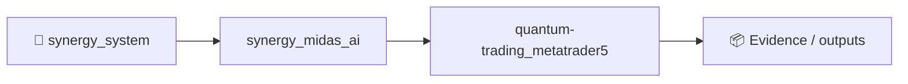
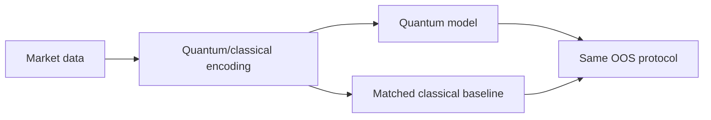

# Quantum Trading: Using IBM Q to Predict Price Movements

Python project that uses quantum computing (IBM Q) and MetaTrader 5 to predict price movements in financial markets. The project combines classical algorithmic trading with quantum computing to analyze market trends and predict future price directions.

## Requirements

- Python 3.9+
- MetaTrader 5
- Qiskit
- Pandas
- PyCrypto

## Installation

```bash
git clone https://github.com/your-username/quantum-trading.git
cd quantum-trading
pip install -r requirements.txt


<!-- SYNERGY-FEDERATION-PASSPORT:START -->
---

## 🧭 SYNERGY federation passport

**Домен:** 📈 Trading / quantum R&D  
**Архитектурный родитель:** [`synergy_midas_ai`](https://github.com/Shtenco/synergy_midas_ai)  
**Архитектурный корень:** [`synergy_system`](https://github.com/Shtenco/synergy_system)



Связь выше показывает место в федерации и **не является доказательством runtime dependency**. Фактические зависимости должны подтверждаться импортами, API-контрактами, manifests, deployment-конфигурацией или тестами.

### Единая шкала доказательности

`GREEN` = воспроизводимо подтверждено · `CANDIDATE` = реализация есть, доказательство неполное · `R&D` = эксперимент · `STUB` = архитектурный узел · `LEGACY` = provenance.

### Навигация

- [📚 Атлас всех 75 репозиториев](https://github.com/Shtenco/synergy_system/blob/main/docs/SYNERGY_REPOSITORY_ATLAS.md)
- [🧾 Машиночитаемый registry](https://github.com/Shtenco/synergy_system/blob/main/registry/SYNERGY_REPOSITORIES.json)
- [🧭 SYNERGY SYSTEM](https://github.com/Shtenco/synergy_system)

### Общее правило утверждений

README не должен утверждать больше, чем подтверждают код, тесты и сохранённые артефакты. Для рыночных/экономических проектов backtest или внутренняя переоценка не равны реализованной внешней прибыли; для AI/infra проектов benchmark или диаграмма не равны production-надежности.

<!-- SYNERGY-FEDERATION-PASSPORT:END -->

---

# ⚛️ Глубокий доказательный паспорт Quantum Trading

## Реальность `main`

Legacy R&D prototype: `main.py`, `requirements.txt`, README и LICENSE. Нет benchmark/evidence suite.

## Главный scientific question

Нужно доказать не то, что Qiskit можно вызвать из trading pipeline, а что quantum component даёт измеримое улучшение против matched classical baseline при одинаковых данных и compute budget.



## Promotion gate

- exact circuit/backend;
- simulator vs real quantum hardware clearly separated;
- classical baseline;
- repeated seeds/shots;
- time-series OOS;
- costs if trading benefit claimed.

Пока статус корректно — **LEGACY QUANTUM TRADING EXPERIMENT**.
