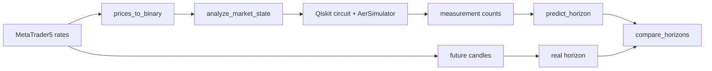
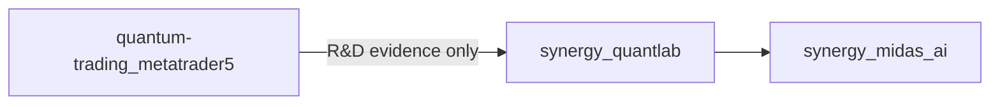

# ⚛️ Quantum Trading + MetaTrader 5 — verified legacy research dossier

> **Статус:** 🕰️ LEGACY / 🔬 R&D prototype.
> **Проверено по фактическому `main`:** 29.09.2026.
> **Ключевой вывод аудита:** текущая квантовая схема **не кодирует рыночную последовательность `price_binary`**, поэтому predictive claim не доказан.

## 1. 🎯 Что исследует проект

Репозиторий экспериментирует с объединением:

- MetaTrader 5 historical prices;
- бинарного представления направления свечей;
- Qiskit / Aer simulator;
- quantum-style phase circuit;
- построения битового «горизонта» прогноза;
- последующей проверки против будущих свечей.

Это исследовательский прототип, а не торговая система и не доказательство quantum advantage.

## 2. 📦 Фактическое дерево `main`

```text
quantum-trading_metatrader5/
├── LICENSE
├── README.md
├── main.py
└── requirements.txt
```

`requirements.txt`:

```text
MetaTrader5
numpy
qiskit
qiskit-aer
pycryptodome
pandas
```

Нет:

- test suite;
- CI;
- pinned versions;
- benchmark artifacts;
- train/OOS dataset;
- experiment manifest;
- classical matched baseline.

## 3. 🏗️ Реальный pipeline в `main.py`



### Получение данных

`get_price_data()` вызывает:

```python
mt5.copy_rates_from_pos(symbol, timeframe, offset, n_candles)
```

Defaults:

- symbol = `EURUSD`;
- timeframe = `TIMEFRAME_D1`;
- n_candles = 256.

### Бинаризация

`prices_to_binary(df)` строит строку:

- `1`, если текущий close выше предыдущего;
- `0` иначе.

Результат дополняется слева до 256 символов.

### Future horizon

`calculate_future_horizon()` сравнивает последовательные future closes и создаёт бинарную строку длиной horizon.

## 4. 🚨 Главный validation blocker

Функция:

```python
def analyze_market_state(price_binary, num_qubits=22):
    a = 70000000
    N = 17000000
    qc = qpe_dlog(a, N, num_qubits)
    ...
```

принимает `price_binary`, **но не использует его ни в одном вычислении**.

Следствие:

[
QOutput perp PriceBinary
]

в текущей реализации, то есть quantum measurement distribution определяется фиксированными `a`, `N`, circuit structure, simulator/shots и randomness backend, но не историей рынка.

Это означает, что текущий код **не доказывает market-conditioned quantum prediction**.

Любая observed accuracy может возникать из:

- случайности shots;
- перекоса BULL/BEAR;
- конструкции `predict_horizon`;
- выбора периода;
- small sample;
- data leakage/selection;
- coincidence.

## 5. 🧠 Что делает quantum circuit

`qpe_dlog(a, N, num_qubits)`:

1. создаёт `num_qubits + 1` quantum register;
2. применяет Hadamard к первым qubits;
3. переводит последний qubit в `|1⟩`;
4. применяет controlled-phase с фазой, зависящей от:
   [
   a^{2^q} mod N
   ]
5. выполняет последовательность H/controlled-phase;
6. swaps;
7. measure.

Это quantum-inspired experiment, но README не называет его подтверждённым discrete-log solver или QPE implementation без отдельной математической верификации.

## 6. 📥 Inputs

Фактические runtime inputs:

- MT5 connection;
- EURUSD/D1 по умолчанию;
- offset, вводимый пользователем;
- horizon length;
- historical/future rate arrays.

Но **рыночный binary sequence пока не входит в quantum state preparation**.

## 7. 📤 Outputs

Программа печатает:

- event-horizon price;
- binary price tail;
- top measurement states;
- real horizon;
- predicted horizon;
- number of ones;
- bit-match accuracy;
- BULL/BEAR direction result;
- per-bit weighted probabilities.

Эти outputs являются experiment diagnostics, а не audited trading performance.

## 8. 🧪 Функция прогнозирования

`predict_horizon()` берёт top-10 quantum states и для каждой позиции считает weighted ones/zeros.

Важно: веса нормализуются относительно **всех** counts:

[
w_i = rac{count_i}{total_counts}
]

но рассматриваются только top-10 states. Поэтому сумма `weighted_ones + weighted_zeros` на bit может быть меньше 1.

Это допустимо как эвристика, но не calibrated probability без дополнительной нормализации/валидации.

## 9. 📊 Метрики текущего кода

### Bit accuracy

[
Accuracy_{bit}
=
rac{# matching bits}{horizon}
]

### Direction result

Реальный и predicted horizon преобразуются в:

```text
BULL if ones > horizon/2
else BEAR
```

и затем сравниваются как WIN/LOSS.

Этого недостаточно для trading validation.

Не хватает:

- return after signal;
- transaction costs;
- spread/slippage;
- baseline accuracy;
- class balance;
- confidence intervals;
- multiple OOS windows;
- repeated seeds/shots.

## 10. ⚠️ Дополнительные технические риски

### Unpinned dependencies

`requirements.txt` не фиксирует версии. Qiskit/MetaTrader dependencies могут менять API.

### No deterministic seed

Aer simulation запускается без зафиксированного random seed, поэтому counts могут меняться.

### `sha256_to_binary()` не используется

Функция существует, но не участвует в main prediction path.

### `predict_trend()` и `verify_prediction()`

Определены, но основной `analyze_from_point()` использует другой horizon comparison path.

### Index/time representation

`copy_rates_from_pos` → DataFrame без явной конвертации MT5 `time` в DatetimeIndex, поэтому `horizon_point_time` обычно остаётся `None`.

### No automated experiment loop

Программа интерактивная и проверяет один offset за запуск.

## 11. 🧪 Минимальный scientific repair plan

### M1 — market-conditioned encoding

Сделать явное:

[
PriceBinary 
ightarrow QuantumState
]

Например angle/amplitude/basis encoding с фиксированной формальной спецификацией.

### M2 — matched classical baseline

Для тех же features и horizon сравнивать минимум:

- majority-class;
- persistence;
- logistic regression;
- random forest/CatBoost;
- простую Markov model.

### M3 — walk-forward

```text
past only
→ predict unseen horizon
→ score
→ advance
```

Без ручного выбора удачных offsets.

### M4 — repeated quantum runs

Для каждой точки:

- фиксированные seeds;
- N independent repetitions;
- confidence interval;
- shot sensitivity.

### M5 — real hardware separation

```text
Aer simulator != IBM quantum hardware
```

Результаты должны храниться раздельно.

## 12. 🧪 Required tests

- `prices_to_binary` known fixture;
- horizon construction;
- top-state probability logic;
- deterministic seeded simulator;
- market encoding changes circuit/state;
- shuffled labels destroy predictive edge;
- permuted price sequence changes prediction;
- constant-market baseline;
- class-balance baseline;
- leakage test;
- multiple symbols/timeframes OOS.

Критический metamorphic test:

> если изменить `price_binary`, quantum state/output distribution должна статистически меняться.

**Текущий код этот тест не проходит концептуально**, потому что `price_binary` не используется.

## 13. 🛠️ Воспроизводимость

Текущий expected path:

```bash
git clone https://github.com/Shtenco/quantum-trading_metatrader5.git
cd quantum-trading_metatrader5
python -m venv .venv
# activate environment
pip install -r requirements.txt
python main.py
```

Дополнительно требуется:

- установленный MetaTrader 5 terminal;
- доступный MT5 account/terminal state;
- historical EURUSD data.

Из-за unpinned dependencies точная reproducibility пока не гарантируется.

## 14. 🗺️ Карта файлов

| Путь | Роль |
|---|---|
| `main.py` | весь research pipeline |
| `requirements.txt` | unpinned Python dependencies |
| `README.md` | verified technical dossier |
| `LICENSE` | license |
| `tests/` | ❌ отсутствует |
| `evidence/` | ❌ отсутствует |
| CI | ❌ отсутствует |

## 15. 🔗 Место в SYNERGY

Репозиторий относится к legacy trading / quantum R&D и не должен становиться execution authority.

Архитектурно его результаты могут поступать только как research evidence в:

- [`synergy_midas_ai`](https://github.com/Shtenco/synergy_midas_ai);
- [`synergy_quantlab`](https://github.com/Shtenco/synergy_quantlab);
- science/benchmark pipeline.



## 16. 📊 Evidence maturity

| Claim | Status |
|---|---|
| MT5 data retrieval code exists | ✅ |
| binary market conversion exists | ✅ |
| Qiskit circuit executes in code path | ✅ source exists |
| market data encoded into circuit | ❌ |
| predictive edge demonstrated | ❌ |
| classical baseline beaten | ❌ |
| strict OOS | ❌ |
| real quantum hardware | ❌ |
| trading P&L | ❌ |
| E2E/production | ❌ |

## 17. 🚀 Roadmap

1. encode market data into quantum state;
2. pin dependencies;
3. create deterministic experiment runner;
4. add unit tests;
5. add classical baselines;
6. add rolling OOS;
7. add repeated seeds/shots;
8. save machine-readable evidence;
9. distinguish simulator/hardware;
10. only then evaluate quantum advantage.

## 18. 🛑 Что проект НЕ утверждает

- что текущий circuit предсказывает рынок;
- что quantum advantage доказан;
- что QPE/DLP корректность математически подтверждена;
- что simulator = quantum hardware;
- что WIN/LOSS metric означает прибыльность;
- что существует production trading system;
- что результаты гарантируют будущую доходность.

---

[🧭 SYNERGY SYSTEM](https://github.com/Shtenco/synergy_system) · [📚 Атлас 75 репозиториев](https://github.com/Shtenco/synergy_system/blob/main/docs/SYNERGY_REPOSITORY_ATLAS.md) · [🧾 Registry](https://github.com/Shtenco/synergy_system/blob/main/registry/SYNERGY_REPOSITORIES.json)
